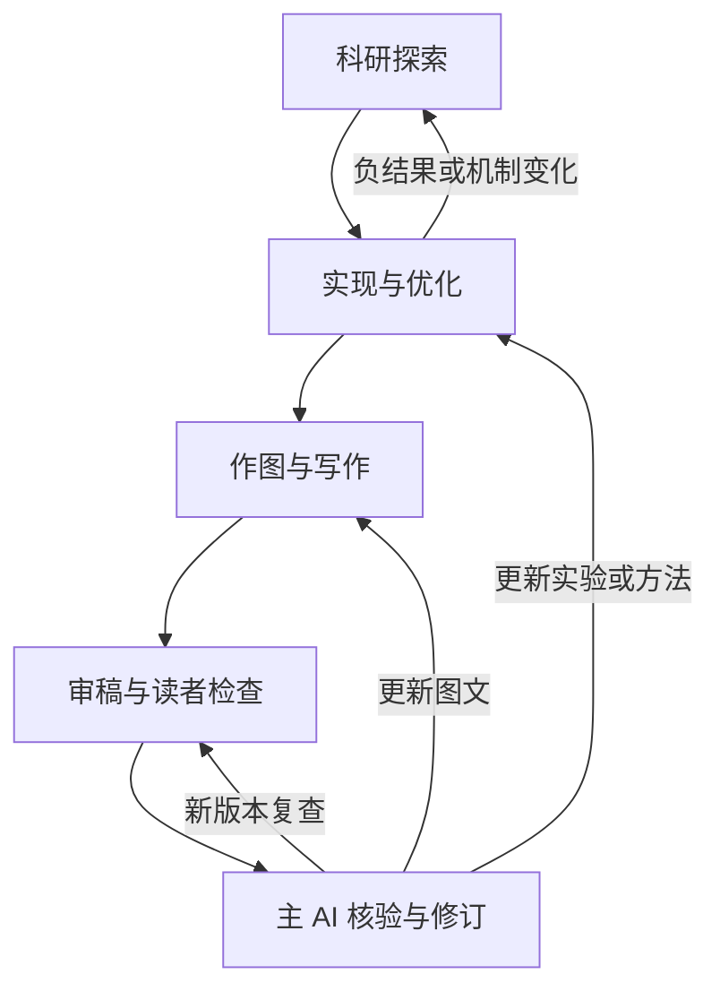

# Research Agent Workflows

面向科研全过程的通用 Agent 工作流与 Prompt：**科研探索 → 代码实现与优化 → 作图 → 论文写作 → 审稿与逐页读者检查 → 核验修订**。

适用于 Claude、Codex 及其他具备相应工具能力的主 AI。覆盖不同学科与论文类型，也支持算法、CPU/GPU、系统和 Infra 研究，不绑定某个模型、设备、技术点或会议。

每个新项目先寻找并评估当前更合适的 Skill，确认没有更合适且经过验证的替代，再采用文档中的后备候选。同一项目持续执行时锁定已验证版本，兼顾长期可用与结果可复现。

> 本仓库提供可直接交给主 AI 的执行规范与完整 Prompt。克隆仓库不会自动安装第三方 Skill，也不会自动注册 Agent；实际运行由当前平台支持的工具与权限决定。

## 六类 Agent

| Agent | 解决什么问题 | 主要交付 | 完整工作流 |
| --- | --- | --- | --- |
| 科研探索 | Idea 是否值得做、与已有工作有什么区别、怎样最小化验证 | 文献证据、可证伪假设、判别实验、研究任务链 | [research_workflow.md](workflows/research_workflow.md) |
| 实现与优化 | 如何从需求到正确且高效的实现 | 方案比较、代码、复杂度分析、CPU/GPU 测量与优化记录 | [implementation_optimization_workflow.md](workflows/implementation_optimization_workflow.md) |
| 论文作图 | 如何用图回答研究问题、解释方法并呈现真实结果 | 图规划、可编辑图源、绘图脚本、图注与视觉检查 | [figure_workflow.md](workflows/figure_workflow.md) |
| 论文写作 | 如何按证据和指定模板完成完整论文 | 正文、源文件、引用核验、可构建 PDF、证据底账 | [paper_writing_workflow.md](workflows/paper_writing_workflow.md) |
| 审稿 | 按目标会议/期刊标准检查贡献、方法和证据 | 有依据的审稿意见、核验→修订→复查任务链 | [reviewer_workflow.md](workflows/reviewer_workflow.md) |
| 读者 | 最终 PDF 有没有生成错误，以及图文是否真正讲清楚 | 逐页图片阅读记录、视觉证据、理解疑点与修复任务 | [reader_workflow.md](workflows/reader_workflow.md) |

## 快速开始

### 1. 获取工作流

```bash
git clone https://github.com/Chosen-David/agent.git
cd agent
```

将仓库路径或相应 Markdown 文件交给主 AI。聊天平台不能访问本地目录时，上传需要的工作流文件和研究材料。仅贴仓库网址不保证模型能读取完整内容，应确认它实际打开了所需文件。

### 2. 选择单个 Agent

例如让主 AI 完成代码实现与优化：

```text
读取 workflows/implementation_optimization_workflow.md，
依据其中的完整 Prompt 和创建/调度指令创建并运行代码实现与优化 Agent。

项目路径：[填写]
任务与目标：[填写]
用户建议方案：[可选；指出哪些是硬约束，哪些允许改进]
正确性/质量与兼容性要求：[填写]
目标硬件、代表输入、资源预算：[填写已知信息]

先动态评估当前相关 Skill，再比较算法、数据结构、成熟库与 CPU/GPU 路线。
在授权预算内完成实现、正确性验证、profiling 和优化，不只给建议。
最终交付代码、时间/空间复杂度、可复现测量、取舍与未验证项。
```

只做其他任务时，将路径换成表中对应文件并提供相关材料即可。作图/科研探索/实现优化/写作的完整 Agent Prompt 在各文件第 6 节；审稿和读者的完整 Prompt 在第 7 节。

### 3. 串起整个研究流程

复制 [主 AI 总调度 Prompt](prompts/orchestrator.md)，填写或直接提供 [项目输入模板](templates/project_brief.md) 所需材料：

```text
读取 README.md、prompts/orchestrator.md 和相关 workflows 文件。
按总调度 Prompt 推进我的项目，只执行当前需要的阶段。

材料/项目位置：[填写]
当前阶段：[只有 Idea / 已有代码数据 / 已有草稿 / 已有最终 PDF]
本轮目标：[填写]
必须保留的约束：[填写]
可执行资源与预算：[填写]
目标 venue 和具体模板：[可选]

在已授权范围推进，不因材料未整理成固定目录停工。
把不确定项列成可检验任务；每项结论、图表与文字关联实际证据版本。
```

已有结果可从作图或写作开始；已有最终 PDF 可直接进入审稿与读者检查。无需每次从选题重走全部阶段。

## 协作与闭环



主 AI 负责维护任务依赖和共享证据。审稿/读者 Agent 提出的疑点先核验，允许被反证驳回；确认问题后修改，再对新产物复查。不能把意见直接当事实，也不能只凭“代码或文字已经改了”关闭任务。

若平台支持子 Agent，可按所需角色配置；不支持时，使用分开的执行阶段、记录和报告完成同样流程，不声称启动了不存在的 Agent。多个角色修改同一产物时，由主 AI 明确写入负责人，避免相互覆盖。

## 关键约定

- **Skill 可替换。** 先按能力检索当前候选，核实真实入口、依赖和效果。star 数、更新时间和宣传不是质量证明。
- **方案可反思。** 实现 Agent 保留用户硬约束，主动挑战建议方案；比较算法、数据结构与执行后端，而非只做局部调参。
- **学习先进解法。** 检索原始论文、官方实现与成熟库，建立强基线；按需关联 LeetCode 算法模式，写清真实场景与题目的对应和差异。
- **按硬件优化。** 先识别 CPU/GPU 型号和可用特性，再选择 PTX、矩阵/异步原语或 CPU SIMD 等路径；检查编译结果、正确性和实际收益，保留必要的 fallback。
- **性能靠测量。** 分析时间、空间及必要的通信复杂度，固定正确性与测量口径，记录负结果；最优结论限于实际探索范围与工作负载。
- **证据贯穿全程。** 假设、预测、实测与结论分开；论文数字与图表使用同一来源，不虚构实验或引用。
- **模板优先。** 写作优先使用用户给定的具体模板；未提供时查当前目标 venue 的官方规则，不能沿用过时页数或格式。
- **PDF 真正逐页读。** 读者 Agent 打开最终 PDF 的每页渲染图，检查乱码、重叠、图表含义和跨页理解；提取文本、编译成功或生成截图都不等于完成阅读。
- **工作流输出可执行。** 任务有输入、依赖、负责人、动作、验收和失败处理；缺资源则标记阻塞并继续其他可做任务。

## Skill 安装与长期维护

每份工作流第 1 节规定动态选型，第 2 节提供后备 GitHub 地址及安装说明。实现优化的后备候选覆盖 AKO4ALL、CPU 性能分析、算法模式识别、CUDA/PTX 和成熟 GPU 库选型；实际选择以当前任务和环境为准。

运行时保存选型理由、查询日期、仓库入口、精确 commit、依赖和本地修改状态。新项目、平台变化、原工具失效或明确要求更新时重新评估；同一项目持续执行时复用已验证版本，不在每张图、每次修订前盲目更新。

后备资料最初核查于 **2026-10-01**；这不是对未来可用性的保证。第三方代码不随本仓库分发，下载和使用时遵守对应项目许可证、依赖和平台要求。仓库不提供“一次安装所有候选”的脚本，避免引入无关依赖。

## 仓库导航

| 路径 | 用途 |
| --- | --- |
| [workflows/](workflows/) | 六份独立、完整的角色工作流及 Prompt |
| [prompts/orchestrator.md](prompts/orchestrator.md) | 主 AI 的阶段选择、任务管理和跨角色交接 |
| [templates/project_brief.md](templates/project_brief.md) | 可选的项目输入模板；不要求所有字段先填齐 |

早期独立文件中的作图 `workflow.md` 在本仓库统一为 `workflows/figure_workflow.md`。各工作流内提到的其他工作流文件名，均指向同一 `workflows/` 目录。
