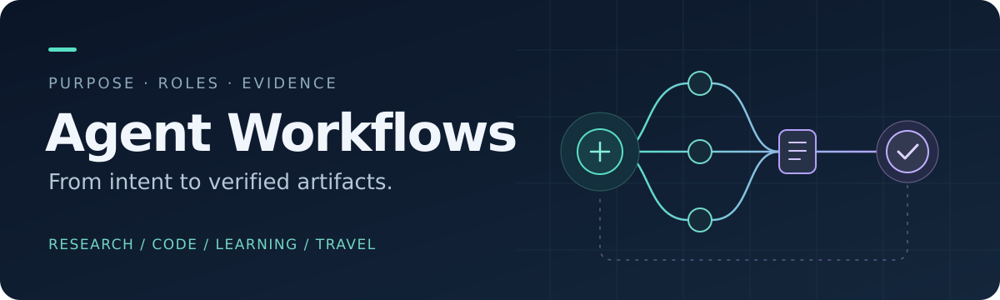
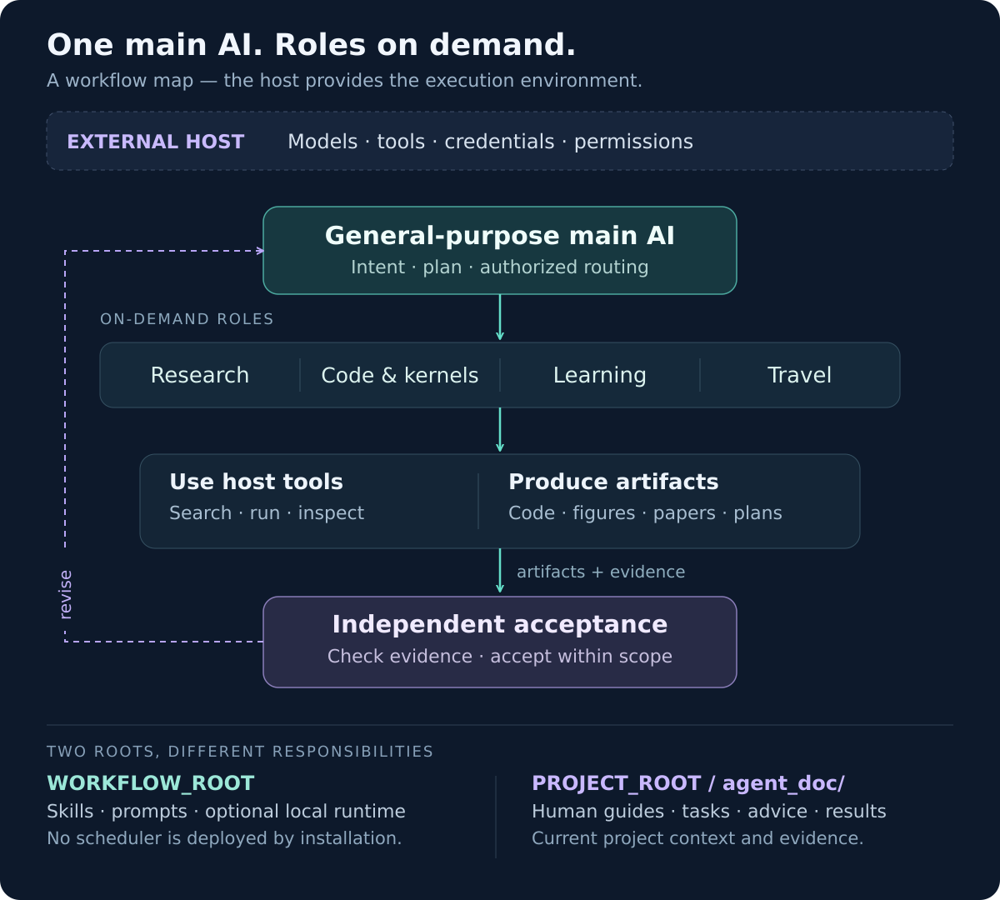

<div align="center">



# Agent Workflows

**让通用 AI 按需协作，把目标推进为可核验的交付。**

科研 · 代码与 Kernel · 论文学习 · 旅行规划

[快速开始](#快速开始) · [能力地图](#能力地图) · [系统架构](#系统架构) · [项目文档](#项目文档属于你的项目) · [开发与验证](#开发与验证)

</div>

---

把专业能力接入你正在工作的项目：主 AI 保持通用身份，按目标选择技能，围绕代码、数据、图表与文稿组织协作。简单问题直接处理；复杂任务才使用计划审核、任务 DAG、版本化交接与独立验收。

仓库提供 **15 个角色技能、2 个插件包、可复制工作流，以及可选的本地运行时**。模型、工具、认证和运行资源由实际宿主提供；安装工作流本身不会启动模型或后台服务。

### 为什么这样组织

| 按需组合 | 交付可追溯 | 项目各自独立 |
| :--- | :--- | :--- |
| 一个通用主 AI，按任务加载专业角色；无需每次启动整套科研流程。 | 从输入、实现到最终产物保留版本与证据；结果经过独立检查再消费。 | Project A 的指南、任务与结果留在 Project A，接入多个项目也不混用上下文。 |

## 快速开始

选择与你的宿主匹配的一条接入路径。**需要完整的 Claude 项目调度时选本地安装；只按需使用插件技能时选 marketplace，避免在同一项目重复安装同名技能。**

### Claude Code · 完整项目接入

需要 Python 3.10+、Git 和可用的 Claude Code。安装脚本无 pip 依赖；Linux/WSL 推荐，原生 Windows 需要目录符号链接权限。

```bash
git clone https://github.com/Chosen-David/agent.git
python3 agent/setup.py --target /absolute/path/to/ProjectA
```

随后进入 **Project A** 启动 `claude`。安装会保留已有项目规则，接入全部角色技能和 Claude 子 Agent。检查安装：

```bash
python3 /absolute/path/to/agent/setup.py --target /absolute/path/to/ProjectA --check
```

[安装内容、旧项目迁移、更新与卸载 →](SETUP.md)

<details>
<summary><strong>Codex · 用户级技能接入</strong></summary>

在已克隆、已提交的 agent 仓库中执行：

```bash
cd agent
python scripts/setup_codex.py
python scripts/setup_codex.py --check
```

脚本管理用户级技能与调度入口，保留既有指引；同名或本机修改冲突会阻止覆盖。随后在目标项目中启动 Codex。文件接线成功与模型实际发现/调用是两项检查。

[安装、版本同步与恢复说明 →](docs/codex_adoption/README.md)

</details>

<details>
<summary><strong>Claude marketplace · 按需安装技能包</strong></summary>

在支持插件的 Claude Code 交互会话中添加本仓库 marketplace，再选择需要的插件：

```text
/plugin marketplace add Chosen-David/agent
/plugin install research-assistant@chosen-david-agent-skills
/plugin install travel-assistant@chosen-david-agent-skills
```

在插件界面确认安装范围和实际启用状态。插件名来自本库 [marketplace 清单](.claude-plugin/marketplace.json)；命令方式核对于 2026-10-08，见 [Claude Code 官方说明](https://code.claude.com/docs/en/discover-plugins)。此方式与完整项目安装的接入范围不同，不自动配置主 AI 监督器。

</details>

<details>
<summary><strong>其他主 AI / 网页会话 · 使用独立工作流</strong></summary>

让宿主读取 [通用调度入口](prompts/orchestrator.md)，或上传所需的 [工作流 Markdown](workflows/)。只提供链接不能证明模型已经读到文件；能否执行取决于宿主实际工具和权限。仓库也保留 [Codex 插件目录](.agents/plugins/marketplace.json)，是否支持导入及实际安装状态需在对应客户端确认。

```text
当前项目：Project A（给出真实路径或上传材料）
目标：追踪推理热路径，提出并验证一个优化候选。
约束：先保持正确性；没有目标硬件时只交设计和待测项。
交付：代码定位、候选取舍、验证证据和下一步。
按需选择技能，不必启动所有角色。
```

</details>

## 能力地图

从你想拿到的产物出发，再选择工作流。

| 你要完成的事 | 交付重点 | 入口 |
| :--- | :--- | :--- |
| **推进科研项目** | 查新、可证伪假设、最小实验、写作与审读衔接 | [科研主调度](prompts/research_orchestrator.md) |
| **读懂代码与系统** | 固定 commit 的调用路径、控制/数据流与机制证据 | [代码阅读](workflows/code_reading_workflow.md) |
| **实现与性能优化** | 正确性基线、profiling、CPU/GPU 候选及测量边界 | [实现与优化](workflows/implementation_optimization_workflow.md) · [编译反馈](workflows/kernel_optimization_feedback.md) |
| **画清方法与结果** | 可编辑架构图、可追溯数据图、最终尺寸检查 | [架构图](workflows/diagram_workflow.md) · [数据可视化](workflows/data_visualization_workflow.md) |
| **写作与修订论文** | 模板、证据忠实、引用、科学审稿、最终 PDF 逐页检查 | [写作](workflows/paper_writing_workflow.md) · [审稿](workflows/reviewer_workflow.md) · [PDF 审读](workflows/reader_workflow.md) |
| **陪读与理解知识** | 原文定位、讲解卡、直觉/公式/例子与按需图解 | [论文伴读](workflows/paper_reading_companion_workflow.md) · [概念讲解](workflows/concept_explanation_workflow.md) |
| **调用知识建模** | 按结构检索、核对前提、跨领域映射与拒用反例 | [知识库](knowledge/README.md) · [建模](workflows/knowledge_modeling_workflow.md) |
| **规划可执行旅行** | 营业窗口、通勤、预约、午休、预算与行程修订 | [旅行规划](workflows/travel_planning_workflow.md) |

<details>
<summary><strong>展开全部 15 个角色与职责</strong></summary>

以 [角色注册表](config/role_registry.json) 为准；科研插件包含 14 个技能，旅行插件包含 1 个技能。

| 角色 | 职责 |
| :--- | :--- |
| `research-assistant` | 科研任务协调与交付汇总 |
| `research-explore` | 查新、假设与实验设计 |
| `research-implement-optimize` | 代码实现、正确性与性能优化 |
| `research-figures` | 混合图、多面板与整体风格协调 |
| `research-diagrams` | 方法、流程与系统架构图 |
| `research-data-visualization` | 实验数据与统计图表 |
| `research-write` | 论文写作与修订 |
| `research-review` | 贡献、方法、证据与科学审稿 |
| `research-read-pdf` | 最终 PDF 逐页视觉与读者检查 |
| `paper-reading-companion` | 原文伴读与阅读状态 |
| `explain-research-concepts` | 概念、公式、机制；借鉴优秀博客的渐进讲解与教学图型 |
| `code-reading` | 源码定位与机制分析 |
| `code-organization` | 文件组织、产物交接与 CODEMAP |
| `model-with-knowledge` | 基于有条件知识的建模与推导 |
| `travel-planner` | 旅行研究、行程与约束核验 |

[科研插件](plugins/research-assistant/) · [旅行插件](plugins/travel-assistant/) · [模式与跨模式调用](prompts/modes.md)

</details>

## 系统架构



图展示的是**职责与交付关系**。独立角色需由宿主实际派发；没有该能力时可顺序执行相同工作流，但不能把角色名称当成多个模型已运行。

### 从产出到可信交付

复杂任务在执行前固定目标、输入、约束与验收条件；执行后让独立检查者读取实际产物。发现问题时，以稳定 ID、位置、版本和复验条件交回责任方，保留首轮意见和修订记录。

| 机制 | 解决的问题 | 实现与边界 |
| :--- | :--- | :--- |
| **计划审核与任务 DAG** | 遗漏要求、错误依赖、重复派发 | [双主 AI](workflows/dual_main_workflow.md) · [任务监督](workflows/task_supervision_workflow.md) |
| **资源感知并发** | 可并行任务被串行化、汇总缺分片 | [因果拆分与完整汇总](workflows/causal_task_orchestration_workflow.md)；仅使用实际已授权资源 |
| **定向证据交接** | 旧消息、版本漂移、返修无法闭环 | [通信工作流](workflows/agent_communication_workflow.md)；本地收件箱是 opt-in，不是独立模型调度器 |
| **独立结果验收** | 产出文件就被当作成功、旧 pass 被复用 | [结果校验](workflows/result_validation_workflow.md) · [检索与复用](workflows/result_reuse_workflow.md) |
| **知识与项目记忆** | 前提失效、纠错后旧结论继续传播 | [知识接入](workflows/knowledge_access_workflow.md) · [项目记忆](workflows/project_memory_workflow.md) |

本地 `agent_runtime/` 提供持久状态、租约、重试和取消等执行基础。真实模型 adapter、凭据、服务器资源与后台部署需另行接入；tmux 可应对 SSH 断开，不能保证跨主机断电或重启继续运行。

## 项目文档属于你的项目

**工作流安装在哪里，与项目文档写在哪里，是两件事。**

| 本次工作 | 指南、任务与结果的位置 |
| :--- | :--- |
| 开发 Project A | `ProjectA/agent_doc/` |
| 开发 Project B | `ProjectB/agent_doc/` |
| 升级本仓库 | `agent/agent_doc/` |

在已有目标项目下显式初始化，示例路径请替换为真实绝对路径：

```bash
python /absolute/path/to/agent/scripts/project_docs.py --root /absolute/path/to/ProjectA init
```

| 相对目标项目的路径 | 内容与维护者 |
| :--- | :--- |
| `agent_doc/guide/GUIDE.md` | **人类编写，AI 只读。** 初始化仅创建空目录，不代写指南。 |
| `agent_doc/task/TASK.md` | 主 AI 维护的唯一任务索引，详情放 `task/task_details/`。 |
| `agent_doc/advice/` | 人类/AI 建议；先核验证据再采用，不自动成为授权。 |
| `agent_doc/results/<run_id>/` | 数据、元信息、真实产物及独立验证记录。 |

已有 `doc/`、`docs/` 保留原用途；缺少 Project A 的指南时不回退读取 agent 库的指南或历史任务。旧根 `TASK.md` 需要先检查再显式迁移。

[项目目录说明](agent_doc/README.md) · [治理、边界与恢复](workflows/project_document_workflow.md)

## 论文伴读：两种使用方式

| 本地 Web 阅读器 | 离线伴读页 |
| :--- | :--- |
| PDF 原页与提问、讲解、笔记并排；可显式连接本机已登录的 Codex CLI。 | 由 PDF 生成自包含 HTML，内嵌原页和已有讲解卡，支持分批页码。 |
| [启动与模型连接说明](apps/paper-reader/README.md) | [生成脚本与流程](workflows/paper_reading_companion_workflow.md) |

离线页本身不带实时模型后端；本地 Web 阅读器也不会自动继承当前网页聊天。生成页面或渲染 PDF 不等于 AI 已阅读所有页。

## 开发与验证

在完整 checkout 的仓库根目录运行基础检查；部分可选测试需要额外依赖，跳过项应单独报告。

```bash
python -m unittest discover -s tests -v
python -m unittest discover -s apps/paper-reader/tests -v
python scripts/sync_plugin_references.py --check
python scripts/project_docs.py --root . validate
```

这些检查覆盖程序行为、结构契约与包内引用；**不能替代真实角色任务、同条件性能测量或宿主集成验证**。当前仓库没有用一个总分代表所有能力。

- [评测入口与任务集](evals/README.md)：程序测试、真实角色任务、交接、A/B 与外部集成分开记录。
- [后端注册表](config/backend_registry.json)：可发现不等于凭据、模型或服务已就绪。
- [代码 Agent 最近升级](agent_doc/results/kernel-feedback-20261008/report_by_gpt.md)：编译诊断、条件化优化与验证范围。
- [持续优化台账](docs/continuous_optimization/README.md)：研究依据、负结果与未完成事项。

### 深入阅读与参与

| 想了解什么 | 去哪里 |
| :--- | :--- |
| 主 AI 如何选择工作流 | [通用调度](prompts/orchestrator.md) · [决策协议](prompts/decision_review.md) |
| 代码和产物如何组织 | [CODEMAP](CODEMAP.md) · [文件管理与交接](workflows/code_organization_workflow.md) |
| 如何借鉴外部实现 | [生态对照](docs/agent_landscape.md) · [外部项目取舍](docs/external_projects.md) |
| 贡献新能力或复现问题 | [仓库协作规则](AGENTS.md) · [任务索引](agent_doc/task/TASK.md) · [Issues](https://github.com/Chosen-David/agent/issues) |

提交改进时说明真实问题、触发方式、预期交付与可复核证据。新增角色应有清晰边界、输入输出和降级方式；优先复用现有工作流。性能收益需要同条件测量，美观的图表也必须忠实于方法与数据。

---

<div align="center">

**从目标出发，以证据交付。**

[开始接入](#快速开始) · [浏览工作流](workflows/) · [查看实现](CODEMAP.md)

</div>
