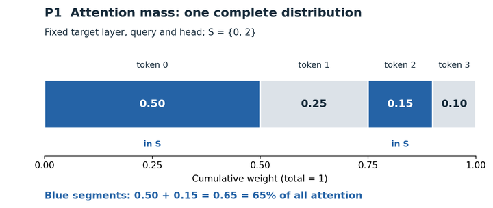
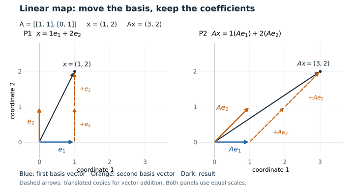

# 第 1 题

**这里的 attention mass 是：候选 token 集合在这份完整注意力分布中占了多少权重。** 固定同一个目标层、query 和 head，对集合 \(S\) 内的权重求和即可；本例是 **0.65，也就是 65%**。

你提出的“候选层分数和 ÷ 目标层 top-k 分数和”混进了另一层和另一个分母。这里候选的是 **token 索引集合** \(S\)，不是另一层的权重分布；即使这些索引由别的层选出，计算这里的 mass 时，也应回到给定的目标层权重 \(a\) 取值。

看图 P1：整条长度是 1，四段分别对应四个 token；蓝色且标有“in S”的两段是被选中的 token 0 和 2。**把这两段长度相加**，就是所覆盖的注意力质量。横轴表示累计权重，不是 token 的索引；这是题目给定的教学数据。

对应到公式：

\[
M(S)=\sum_{i\in S}a_i=a_0+a_2=0.50+0.15=0.65.
\]

这里 \(a_i\) 是完整 softmax 后的权重，已经满足 \(\sum_{i=0}^{3}a_i=1\)。若写成“部分占总体”的比值，也应是

\[
\frac{\sum_{i\in S}a_i}{\sum_{i=0}^{3}a_i}=\frac{0.65}{1}=0.65.
\]

用同一例子就能看出 top-k 分母的差别：若 \(k=2\)，目标层最大的两个权重是 0.50 和 0.25，总和为 0.75；于是 \(0.65/0.75\approx0.867\)。这个数回答的是“候选集合的质量相当于最优两个 token 质量的多少”，它是**另一个相对指标**，不是本题占全部注意力的 65%。

作为边界检查，选中全部 token 时 mass 是 1，空集时是 0；若把选中项重新归一化成总和为 1，就会丢掉“原本覆盖了多少”的信息。以上只使用本题给定的定义，不假定某篇论文另有指标约定。

# 第 2 题

不会，给 softmax 的所有输入加上同一个有限常数 \(c\)，在精确数学运算下输出不变。
因为 \(\displaystyle \frac{e^{z_i+c}}{\sum_j e^{z_j+c}}=\frac{e^c e^{z_i}}{e^c\sum_j e^{z_j}}=\frac{e^{z_i}}{\sum_j e^{z_j}}\)，分子与分母的公共因子 \(e^c\) 抵消了。

# 第 3 题

**因为任意向量都能由基向量组合出来，而线性变换必须保留这套“缩放再相加”的规则。** 只要知道每个基向量去了哪里，其余向量的去向就被这些规则确定了。

先把你熟悉的矩阵乘法看成“对列向量加权”。这里

\[
e_1=\begin{bmatrix}1\\0\end{bmatrix},\qquad
e_2=\begin{bmatrix}0\\1\end{bmatrix},\qquad
x=\begin{bmatrix}1\\2\end{bmatrix}=1e_1+2e_2.
\]

这说明 \(x\) 的组合方式是“1 份第一基向量，加 2 份第二基向量”。用 \(A\) 左乘两个基向量，恰好取出矩阵的两列：

\[
Ae_1=\begin{bmatrix}1&1\\0&1\end{bmatrix}
\begin{bmatrix}1\\0\end{bmatrix}=\begin{bmatrix}1\\0\end{bmatrix},\qquad
Ae_2=\begin{bmatrix}1&1\\0&1\end{bmatrix}
\begin{bmatrix}0\\1\end{bmatrix}=\begin{bmatrix}1\\1\end{bmatrix}.
\]

所以第一根基向量仍然向右，第二根从向上变成了右上方向。现在关键的一步是：**基向量变了，但组合系数 1 和 2 不变**，因为线性变换满足

\[
A(\alpha u+\beta v)=\alpha Au+\beta Av.
\]

按图从左到右看：

- **P1：原来的组合。** 先沿蓝色 \(e_1\) 向右走一步，再沿两根橙色虚线箭头各走一份 \(e_2\)，到达 \(x=(1,2)\)。
- **P2：变换后的组合。** 同样先走一份蓝色 \(Ae_1=(1,0)\)，再走两份橙色 \(Ae_2=(1,1)\)，到达 \(Ax=(3,2)\)。

两图的横、纵轴都是同尺度的坐标轴；橙色虚线是为了首尾相接做向量加法而平移的副本，深色箭头表示从原点到最终结果的向量。图由给定矩阵精确计算，是教学几何图。

把图中的路线写出来：

\[
\begin{aligned}
Ax&=A(1e_1+2e_2)\\
  &=1(Ae_1)+2(Ae_2)\\
  &=\begin{bmatrix}1\\0\end{bmatrix}
    +2\begin{bmatrix}1\\1\end{bmatrix}
   =\begin{bmatrix}3\\2\end{bmatrix}.
\end{aligned}
\]

这不是只对 \(x=(1,2)\) 的巧合：任何 \((s,t)=se_1+te_2\)，都必须变成 \(sAe_1+tAe_2\)。这里系数依然是 \(s,t\)，但它们现在乘的是变换后的基向量，因此结果在原坐标系中的坐标会改变；本例中 \((s,t)\mapsto(s+t,t)\)。

“只要知道基向量的去向”**以线性为前提**。例如非线性映射 \(F(s,t)=(s+t+st,t)\) 也把 \(e_1\) 送到 \((1,0)\)、把 \(e_2\) 送到 \((1,1)\)，却把 \((1,2)\) 送到 \((5,2)\)。因此，真正让矩阵两列足够描述整个变换的，是“基向量能组合出所有输入”加上“线性保证组合规则不变”。
