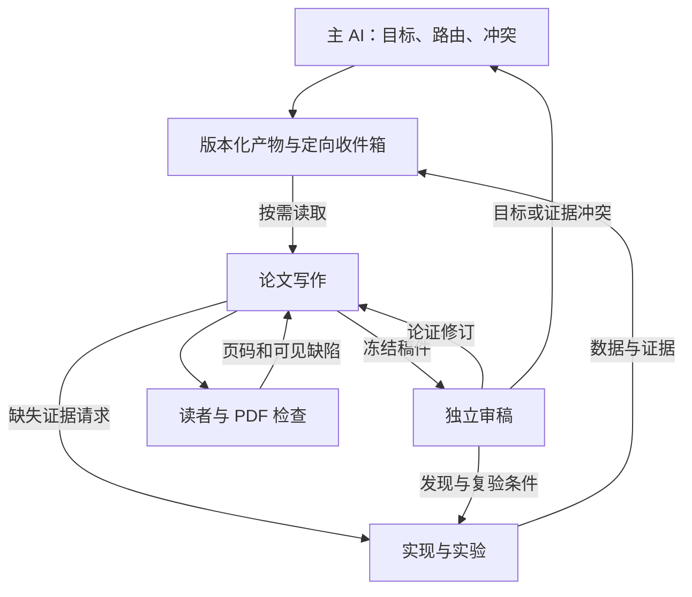

# Agent 通信研究与首批落地（2026-10-06）

## 结论与代码基线

基线 main：`4ddb00f37b960dbbf1c1dcf6878c028dc5cabb8e`。仓库已经有角色注册、主 AI路由、依赖 DAG、执行租约/事件去重、TASK 映射、项目记忆、文件知识库和消费者范围校验。`core.py` 的事件属于监督触发去重，`project_memory.py` 的事件属于记忆审计；它们都不是角色之间的持久收件箱。`validate_handoff.py` 显式校验产物，未提供定向投递与消费者回执。

采用兼容性扩展：**主 AI集中管理目标/授权/冲突，角色沿稀疏的任务通信图直接交接，文件保存证据，事件负责通知，接收者独立验收**。不是让全部角色广播聊天，也不把所有决定交给中心转述。通信图允许审稿反馈环；执行 DAG 的依赖仍无环。

## 核查的原始来源与取舍

以下为本次定向检索/选段核查，**不计作十篇全文精读批次**。固定版本供下一批继续阅读、复现实验；论文结果不能直接当作本仓库收益。2026 来源区分作者预印本、作者标注录用与官方工程文章。

| 来源与实际阅读范围 | 机制与适用前提 | 本仓库取舍 |
|---|---|---|
| [AgentPrune: Cut the Crap](https://arxiv.org/html/2410.02506v1)，2024-10，摘要、通信冗余/方法及实验设置；后续发表状态未在本次确认 | 剪除时空通信图中的冗余边；实验覆盖推理、数学和函数级代码生成 | 采用稀疏通信的设计方向；不部署其学习器，不把短基准迁移为长科研任务的保证 |
| [AgentDropout](https://arxiv.org/html/2503.18891v1)，2025-03；[ACL 2025 正式论文](https://aclanthology.org/2025.acl-long.1170.pdf) 检索确认；核查 v1 摘要、节点/边剪枝及4.1实验设置 | 不同轮次可需要不同参与者；评测模型/基准有明确范围 | 任务阶段只通知相关角色；不允许自动剪掉必须的审稿/读者验收 |
| [HANDRAISER](https://arxiv.org/html/2604.06452v2)，2026-08-14修订；[作者摘要页](https://arxiv.org/abs/2604.06452) 标注 Accepted in CoLM 2026；核查摘要、1–2节 | 接收者决定中断时机；仅提示模型会过早中断，需要学习收益/成本，评测为猜词、排期、辩论 | 采用接收者按需读取；流式中断策略待测，不把摘要压短当作等价实现 |
| [Gated Coordination](https://arxiv.org/html/2604.18975v1)，2026-04-21预印本；核查摘要、3.2–3.3、机制/消融选段 | 区分私有执行状态和公共协调，按关键性、恢复成本及下游影响触发沟通；Minecraft环境及校准前提 | 采用明确事件触发与局部/公共状态分离；不照搬论文权重、阈值或性能数值 |
| [Why Do Multi-Agent LLM Systems Fail?](https://arxiv.org/html/2503.13657v1)，2025-03原始版本，摘要/失败分类入口 | 设计、角色错位与验证问题说明“更多交流”不等于任务可靠 | 保留独立消费者验收和语义复查；本次未完成其全部数据集复现 |
| [Anthropic: How we built our multi-agent research system](https://www.anthropic.com/engineering/multi-agent-research-system)，2025-06-13；架构、生产可靠性、附录 | 主调度与独立上下文，持久产物传轻引用；同步阻塞、异步一致性与成本都有权衡 | 直接复用文件交接及精简引用的模式；不把广度研究收益当成强依赖代码工作的保证 |
| [Anthropic: Patterns and problems in multiagent systems](https://www.anthropic.com/research/multiagent-systems)，2026-08官方研究文章；概述/协调冲突选段 | 多角色目标错位可能导致冲突，能力更强不自动保证协调更好 | 同一目标来源、单路径写入者和主 AI冲突裁决；不按多数赞同验收 |
| [A2A specification](https://a2a-protocol.org/latest/specification/)，2026-10-06读取动态文档，Artifact/流式事件字段 | 定义跨系统任务/产物交换，不能替代业务路由、证据真实性或科学验收 | 作为未来跨宿主接口候选；当前无跨机需求，不引入网络服务，不声称 A2A兼容 |

另检索到 [E2-Explainer](https://arxiv.org/abs/2608.12921)（2026-08），涉及通过遮蔽通信边评估贡献；原始页面本次获取失败，仅搜索摘要可见。列待核查，不计精读、不据此实现或引用具体性能。该方向可形成通信边消融实验，但短任务的边贡献不能直接证明长流程安全可剪。

## 实现与预定验收范围

`agent_runtime/communication.py` 提供 opt-in Mailbox/API/CLI；不改 Engine 的 done、权限、监督和知识接口。它复用既有 handoff 校验器，提供固定通信计划、按角色/任务/事件类型投递、持久待办、重复发布幂等、版本隔离、回执、字节和事件数预算。consume 重新校验引用文件和消费者范围，语义检查后再 ACK。

本次工程验收标准：正确接收者全收到、无关角色不收到；并发重试只存一份事件；重启不丢未处理消息；旧版本/越界路径/篡改产物/漏任务拒收；不同消费者回执独立；预算耗尽显式报错；现有回归无新增失败。模拟通信数量/文件字节不当作真实 tokens、费用或模型成功率。

验收：通信专项14/14；全仓403项中395通过、8跳过；reader 3/3；插件同步与Skill基础检查通过。独立上下文仅取得工作流和场景，实际执行合成数据交接：4个事件、7个定向投递全部有回执，写作子进程exit 73后恢复并跳过重复动作，缺方差发现补充后复算关闭，旧envelope/旧manifest拒绝。主执行者读取原始合成数据并重算均值/样本方差，另目录重放可移植脚本通过。

首次前向脚本因错误文案断言不匹配而失败；运行时已正确拒收，保留失败记录并原库恢复，再干净复跑。该执行验证工作流可操作和接口行为，不是多个独立模型之间的科研协作质量测量。未测模型质量/token A/B、真实Engine adapter与跨机集成。

证据：[verification.json](communication_validation/verification.json)、[前向审计](communication_validation/forward-audit.json)、[首次脚本失败](communication_validation/harness-first-failure.json)、[复算记录](communication_validation/review-recheck.json)。可复跑入口：`python scripts/demo_agent_communication.py`（默认写 `.agent-runs/communication-demo/`；已有运行时拒绝覆盖，可用 `COMMUNICATION_OUTPUT_ROOT` 选择新目录）。专项回归：`python -m unittest discover -s tests -p test_communication.py -v`。高频日志 `.agent-runs/communication-v1/`，独立使用产物 `.agent-runs/communication-forward/`；不发布用户科研材料。

## 尚需验证的提升空间

1. 实际宿主 adapter 将 inbox 接到真实模型任务：每个 recipient 一个消费者，沿现有 run/取消/授权/租约处理，不再起第二套调度器。
2. 固定同一科研任务和材料，以现有中心转述、全广播、定向引用做公平比较。至少覆盖新增实验、审稿返修、旧数据纠正、PDF缺陷四类交接。
3. 指标优先正确关闭的发现、错误证据复用、任务完成与最终质量，再看真实 tokens、工具调用、延迟和返工。未知计未知。
4. 逐边/逐轮消融，评估动态路由、接收者拉取、增量摘要、阻塞优先级；必须保留关键纠错和独立验收边。低频而关键的消息不能按低频删除。
5. 图结构、消息内容、触发时机分别优化，避免一次改完而无法归因。只有同预算真实实验支持时才启用学习式剪枝/中断，不引入未必要的 broker、图数据库或分布式服务。

持续工作已接入原每3小时优化任务并回读确认保持启用，新增内容见 [补充Prompt](../prompts/communication_continuous_learning.md)。保留其十篇精读、全角色/真实交接、冻结候选及发布门禁；本次有界工程交付不宣称完成该大批次。基础数学知识任务仍独立，使用统一 main 同步规则避免覆盖。

## 发布检查点

本地实现已提交，直接main推送被自动审批拒绝，尚未发布；拒绝理由为本轮未明确授权默认分支写入，未尝试其他写接口绕过。已整合并发知识库提交 `11af8dff2b1f599aca8098a1979e59e73ced36c1`，保留两方TASK记录；最终整合回归412项中404通过/8跳过，插件同步通过。待用户明确批准后重新同步、推送、读回；真实多模型效果仍待测。

2026-10-06 22:26 用户已明确批准本次直接main发布并要求定时持续跟进；此前审批等待已解除。发布前同步到 `3dedbb9b0a7f83b6d9a1e015aeb8598a117e4408`，其新增内容仅知识库发布文档，保留并解决TASK追加冲突；通信14/14复验和插件同步通过。

发布完成：main `b9325c5dc609e9a32ae3186e041485a4efa9de9a`，tree `34250047a9be45ac628ad741a023d191ee3c7c5a`，远端及本地Git核对一致；采用非强制、expected_sha保护更新。原每3小时任务启用状态和更新Prompt已回读。真实多模型质量/成本A/B仍列后续验证。
