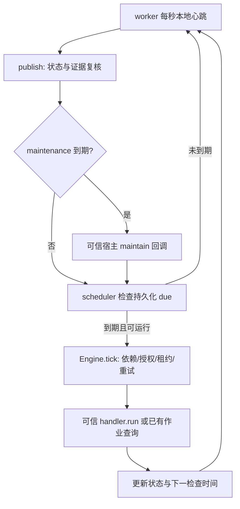

# 监督器：把本地检查与模型唤醒分开

日期：2026-10-10。本页是实际调用链审查与来源建议评估，没有新增模型用量实验。代码定位以本轮提交中的函数为准；本库的 Python 监督器与 Claude Code 会话中的定时提示不是同一种运行机制。

## 实际运行路径

图中的回调和 handler 是否调用模型，由显式宿主 adapter 决定。心跳、SQLite 查询、文件哈希或 tmux 存活检查没有天然的模型 token 开销；若让模型执行这些查询，会产生模型调用与长历史再输入的开销。

| 位置 | 已有行为 | 成本边界/热点 |
| --- | --- | --- |
| `agent_runtime/task_supervisor.py::load_backend` | 没有 adapter 时只提供 `verify_artifacts`；显式加载可信 Python adapter 的 handlers/maintain/verifiers | 安装仓库不等于模型监督已接入。实际成本必须追踪 adapter 的模型请求 |
| `task_supervisor.py::worker` | 每秒 heartbeat/publish；maintenance 独立按 next_check_seconds 到期 | 到期直接 `maintain(report)`，没有语义变更门禁；若宿主每次新开模型，空轮也花钱 |
| `task_supervisor.py::publish` → `task_manifest.py::review` | 重新派生任务、计划审查和已完成结果证明 | 不直接生成审稿文本，但会调用宿主 verifier；若 verifier 每次重新推理，可能比定时维护更贵 |
| `scheduler.py::wake/drain_once` | 变更通知合并、min_seconds 下限、到期原子预留和版本条件更新 | 已有去重机制，不再建一套。检查 due 不等于每次派发模型 |
| `core.py::interval/tick` | 空闲指数退避、min/max 限制、任务依赖/授权/租约/重试/等待预算 | 不能为了少检查删掉超时诊断或重复执行保护 |

因此当前可确认的是可能调用模型的位置，而不是其实际账单。没有逐请求 provider usage/adapter 运行记录，不能断言哪条边最贵，也不能把一秒 heartbeat 当成一秒一次推理。

## Claude 新提交的建议如何使用

来源为 [4b31485](https://github.com/Chosen-David/agent/commit/4b31485ccd79a19021c324ca49bcc18c268cdacf) 更新的 [主会话监督报告](session_supervision_burn.md)。报告描述 Claude 会话任务列表注入与四个定时监督器，给出空轮3–8k tokens、任务列表78→21及约75%体积减少。本轮没有其逐请求原始用量，因此保留为来源自报，不能算本库的新模型验收或推广到 Codex。

| 建议 | 评估 | 本库处理 |
| --- | --- | --- |
| 先本地检测事件，再唤醒主 AI | adapt | advice 已有新的有界 SHA 变更 CLI；宿主还须检查任务、用户、代码/配置/证据变化、到期复审和异常。空 advice 清单不能证明全项目无待办 |
| ETA 一次性计时器 + 完成通知 | adapt/defer 部署 | 复用持久化 scheduler 的 due/wake，而非新增平行计时器；通知可能丢失，ETA 可能不准，须保留有界补查、租约与等待诊断。尚未改变运行中的监督器 |
| 删除已收割的会话临时任务 | adapt | 先保存完整结论、证据、依赖和恢复引用，再按宿主 API 契约清理临时显示；canonical TASK/历史证据保留。不假定所有宿主允许 dangling blockedBy |
| 取消与远端重复的本地审查 | adapt/defer | 只有依赖、问题范围、版本、有效期与审查人覆盖等价时才合并。不能因角色名字相同删除独立验收 |
| [75dc4ba](https://github.com/Chosen-David/agent/commit/75dc4ba03f3569c8a59db2ba5f1fd725da481daf) 的 GPU 信号统一监督 | adapt；reject 单信号判成功 | 可合并同一作业的状态查询与收割入口，但 GPU 空闲/低利用率也可能是等待输入、通信、CPU 后处理、暂停或失败。必须绑定 owned job/PID/作业ID，核对退出状态、日志、完成产物与独立验收；CPU 完成通知也须有持久化补查，不能以通知永不丢失为前提 |
| 短交接、局部读、记忆索引 | adopt with scope | 当前决策/异议/下一步放任务详情，原文与原始证据保持可检索；恢复或依赖变化后重新核对。源文件变短不是总成本证明 |

## 宿主接入契约与下一轮短对照

这一轮没有给所有 adapter 自动插入变更门禁。下一次接入先记录实际模型边：`maintain`、handler 派发、plan/result verifier、主 AI 收割；把单次请求关联到 project_root/run_id/task_id、输入版本、调用原因、请求 ID 和 provider 用量。不把工具输出字符数当作真实 token。

宿主在模型之外计算唤醒原因：advice 新事件、任务状态/依赖变更、用户指令、指南/代码/配置/证据变更、异常/诊断、到期复审。变化比较应排除纯显示时间戳，但不能排除有语义的 deadline、证据状态或 source_error。若只有心跳变化且没有到期事项，可结束本地检查，不创建新的模型会话。事件只有在成功处理后才确认；崩溃或接收失败可恢复，不能扫描后立即 ACK。

verifier 可以按精确来源绑定复用已接受的证明及失效规则，不能把“文件名没变”当证明有效，也不能用缓存规避当前独立验收。合并唤醒后仍保持取消、授权、等待上限、失败恢复与结果消费者门禁。

后续只做一个很短的同条件工作流：不变检查一次 → advice 新回复一次 → 代码/证据变化一次。原版与优化版使用同模型/工具/任务，核对总 input+output、缓存子集、全部主/子/审查角色及重试，同时检查新异议和证据失效被捕获。CPU/哈希导航通过不构成模型质量或费用验证；本轮仍为9/100。

## 调研依据

[Anthropic Managed Agents，2026-04-08](https://www.anthropic.com/engineering/managed-agents) 将可恢复 session 日志与当前模型上下文分开，允许按事件片段检索。这里据此提出原文外置与按需恢复的设计，未移植其延迟实验收益。

[AgentDropout，2025-03-24预印本](https://arxiv.org/abs/2503.18891) 的已读摘要提出识别不同通信轮中的冗余角色/边。这里只用作审查通信拓扑的线索；未读其完整实验，不能照搬摘要的百分比，不能据此删掉本项目独立数据验收。
