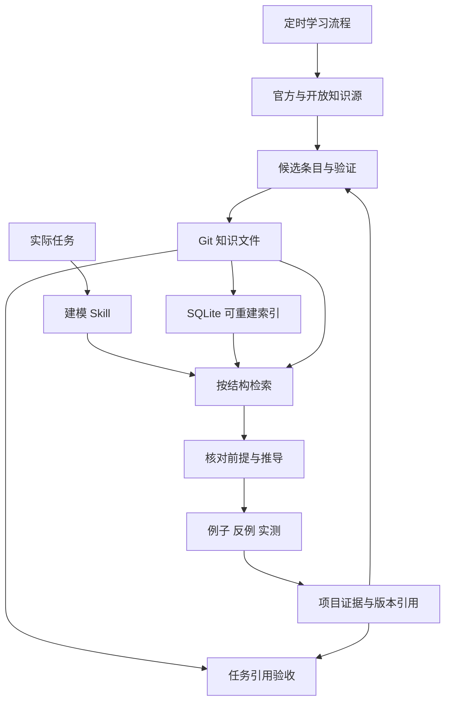

<!-- GENERATED by scripts/sync_plugin_references.py; edit the source workflow instead. -->

# 知识库采用了什么，为什么

2026-10-06 核对官方文档、上游仓库源码和许可；固定 commit/blob 见 [来源锁](../assets/knowledge/upstreams.json)。这是来源优先的最小接入，不是从零重新编写数学百科。新条目先链接和核对已有知识，再记录本项目实际需要的假设、应用映射与反例。未整体导入第三方正文或代码。

| 来源 | 实际采用 | 当前未采用及原因 |
|---|---|---|
| [Claude Context Engineering](https://www.anthropic.com/engineering/effective-context-engineering-for-ai-agents) | 小入口、按需检索、逐步读取 | 不把整库常驻上下文 |
| [Claude Contextual Retrieval](https://www.anthropic.com/engineering/contextual-retrieval) | 每条带可独立解释的摘要、适用条件与出处；章节索引附带条目标题与摘要 | 没有照搬其性能数字；本库尚无向量检索评测 |
| [Claude Agent Skills](https://www.anthropic.com/engineering/equipping-agents-for-the-real-world-with-agent-skills) 与 [编写建议](https://platform.claude.com/docs/en/agents-and-tools/agent-skills/best-practices) | Skill 存操作流程、知识文件按需读取、脚本负责确定性检查 | 不为每个定理建立一个常驻 Skill |
| [mathlib4](https://github.com/leanprover-community/mathlib4) | 固定 Cauchy–Schwarz 所在文件，区分形式化源与应用层推导 | 未安装 Lean、未验证应用命题的 Lean 证明；Apache-2.0 来源只作引用 |
| [QMD](https://github.com/tobi/qmd) | 采用 Markdown 为事实源、SQLite 派生索引可重建、标题上下文与多路排名融合 | 未安装 QMD 整体及其模型依赖；本地以标准库 SQLite FTS5 实现可运行的词法/结构索引 |
| [PageIndex](https://github.com/VectifyAI/PageIndex) | 采用标题层级与章节导航，已实现 tree/section 与原文行号定位 | 未安装 PageIndex 整体或模型摘要服务；本地解析保留精确原文 |

## 本地实现边界

本地 Python 实现项目特有 schema、依赖/哈希验收、候选导入、章节导航和检索编排。全文索引直接调用成熟的 [SQLite FTS5/BM25](https://www.sqlite.org/fts5.html)，不自研 BM25、embedding、向量引擎或定理证明器。公开知识资源与博客可发现候选，上架数学结论优先检查教材、大学课程、原论文或形式化源码；新闻和博客中的未验证猜测保留为 candidate。

评估检索时，以真实项目问题构建留出集，测 Recall@k、错误适用率、前提遗漏、推导验收、延迟/成本；同时比较现有基线与现成后端。候选必须携带版本哈希并回读原文件；不按规模阈值臆测某数据库必然更好。直接把检索结果拼进提示不能保证正确推导。

## 架构与交互

学习更新一般知识，工作流程生成项目证据，两者经核验反馈。现有项目记忆不被知识库替换。本轮升级 v2 已加入增量 SQLite 索引、RRF 排名融合、章节导航、候选导入及来源凭据、原始检索回归。此图描述已落地的文件、脚本和流程关系；定时触发器、QMD、PageIndex、Lean 和远程常驻执行器均未在本轮部署。

第二轮继续采用 SQLite 内置 Porter 分词，保留原始词法基线；用依赖闭包与双向关系构造预算内上下文。具体测量与失败修复见第二轮报告，未将这些确定性机制宣称为密集语义检索。新增基础知识来源为 Cornell 线性系统课程、Boyd 对偶讲义、Maithani 不变量论文 v2、Tong 经典动力学讲义；均记录原文定位，未整体复制或执行第三方证明代码。
